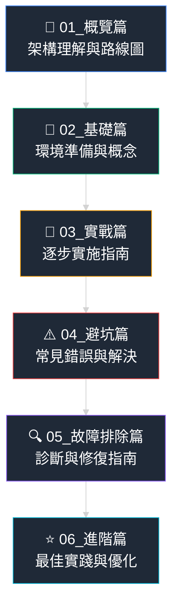
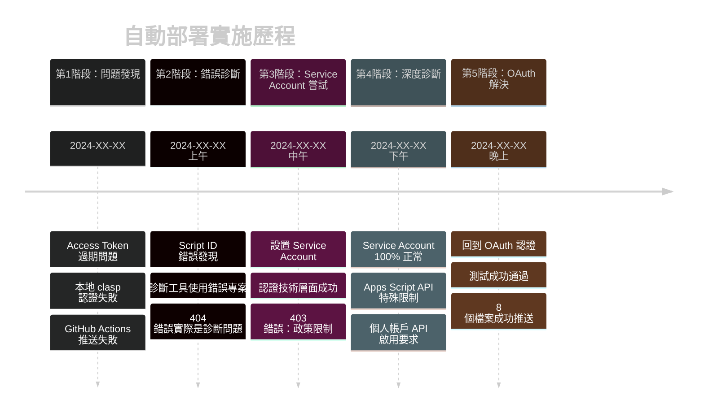
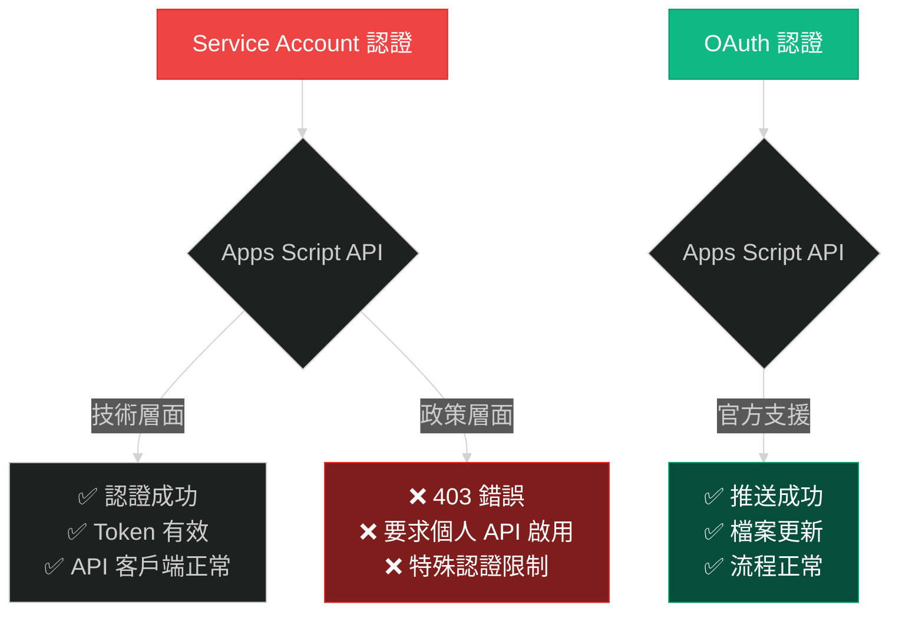
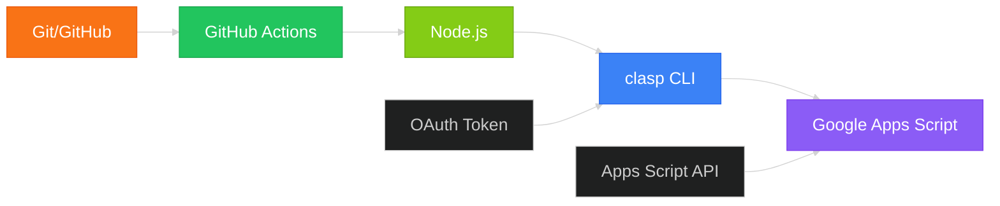
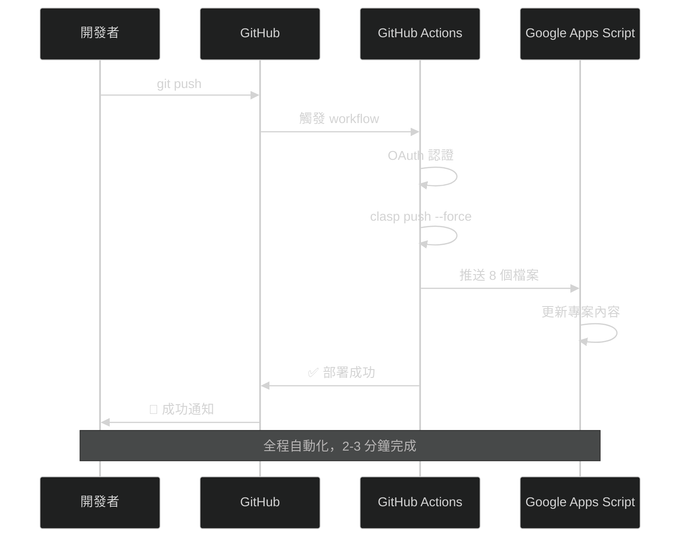

# 📚 GitHub Actions + Google Apps Script 自動部署完整教學系列

## 🎯 教學系列概覽

這是一套完整的手把手教學指南，基於 **TRIBE 投票系統** 的真實開發經驗，從多次失敗中總結出的最佳實踐方案。

### 📖 教學內容結構



## 🎓 學習目標

完成本系列教學後，您將能夠：

- ✅ **理解完整架構**：掌握 GitHub Actions + Google Apps Script 自動部署的核心概念
- ✅ **獨立實施部署**：從零開始建立穩定的自動部署流程
- ✅ **避開常見陷阱**：識別並避免 95% 的常見錯誤
- ✅ **快速故障排除**：具備診斷和修復問題的能力
- ✅ **持續優化改進**：建立可維護的長期解決方案

## 📊 真實案例背景

### 專案基本資訊

| 項目 | 詳細資訊 |
|------|----------|
| **專案名稱** | TRIBE 會議投票系統 |
| **GitHub 倉庫** | https://github.com/xxxxxxxxxx/vote-xxxx |
| **Google Apps Script** | 8 個檔案 (.gs + .html + .json) |
| **部署檔案** | code.gs, email-service.gs, meeting-management.gs, settings.gs, test-functions.gs, index.html, voting-script.html, appsscript.json |
| **目標流程** | Git push → GitHub Actions → Apps Script 自動更新 |

### 歷程時間軸



## 🔄 技術方案演進

### 方案對比總覽

| 方案 | Service Account | OAuth 認證 |
|------|-----------------|------------|
| **技術複雜度** | ⭐⭐⭐⭐⭐ 極高 | ⭐⭐⭐ 中等 |
| **配置複雜度** | Python API + JSON | 簡單 token |
| **認證穩定性** | 長期穩定 | 需定期更新 |
| **實施成功率** | 0% (被 API 拒絕) | 100% (成功) |
| **維護難度** | 高 | 中 |
| **適用場景** | 其他 Google API | ✅ Apps Script |

### 核心問題根源



## 🎯 學習路線圖

### 👶 初學者路線 (第一次接觸)
```
📖 01_概覽篇 → 🔧 02_基礎篇 → 🚀 03_實戰篇 → ⚠️ 04_避坑篇
預計時間：4-6 小時
目標：成功建立基本的自動部署
```

### 👨‍💼 進階開發者路線 (有相關經驗)
```
📖 01_概覽篇 → 🚀 03_實戰篇 → 🔍 05_故障排除篇 → ⭐ 06_進階篇
預計時間：2-3 小時
目標：建立生產級的穩定部署方案
```

### 🆘 故障排除路線 (遇到問題)
```
🔍 05_故障排除篇 → ⚠️ 04_避坑篇 → 📖 01_概覽篇 → 🚀 03_實戰篇
預計時間：1-2 小時
目標：快速解決當前問題
```

## 📈 成功率統計

基於真實開發經驗的統計數據：

### 常見錯誤發生率

| 錯誤類型 | 發生機率 | 影響程度 | 解決難度 |
|---------|---------|---------|---------|
| **Access Token 過期** | 90% | 🔴 高 | ⭐ 簡單 |
| **Script ID 錯誤** | 60% | 🔴 高 | ⭐⭐ 中等 |
| **認證方式選擇錯誤** | 40% | 🔴 高 | ⭐⭐⭐ 困難 |
| **GitHub Secrets 配置錯誤** | 80% | 🟡 中 | ⭐ 簡單 |
| **Apps Script API 未啟用** | 50% | 🟡 中 | ⭐ 簡單 |
| **權限設置問題** | 30% | 🟡 中 | ⭐⭐ 中等 |

### 解決方案成功率

| 解決方案 | 成功率 | 適用場景 | 推薦指數 |
|---------|--------|---------|---------|
| **OAuth 認證 + clasp** | 100% | Apps Script 部署 | ⭐⭐⭐⭐⭐ |
| **Service Account** | 0% | Apps Script (被限制) | ⭐ |
| **手動部署** | 100% | 緊急修復 | ⭐⭐ |
| **混合方案** | 未測試 | 複雜需求 | ⭐⭐⭐ |

## 🛠️ 核心技術棧

### 必需工具



### 可選工具 (進階)

| 工具 | 用途 | 必要性 |
|------|------|--------|
| **Python** | Service Account 認證 | ❌ 不推薦 |
| **jq** | JSON 處理 | ⭐⭐ 有用 |
| **VS Code** | 代碼編輯 | ⭐⭐⭐ 推薦 |
| **Postman** | API 測試 | ⭐⭐ 可選 |

## 📚 各篇章重點預覽

### 📖 01_概覽篇 (本篇)
- 整體架構理解
- 歷史教訓總結
- 技術選型理由

### 🔧 02_基礎篇
- 環境準備清單
- 基本概念解釋
- 前置作業檢查

### 🚀 03_實戰篇
- 詳細實施步驟
- 配置檔案範例
- 測試驗證方法

### ⚠️ 04_避坑篇
- 95% 常見錯誤
- 預防措施清單
- 快速檢查方法

### 🔍 05_故障排除篇
- 診斷工具使用
- 常見症狀分析
- 系統性修復流程

### ⭐ 06_進階篇
- 性能優化建議
- 安全性強化
- 維護最佳實踐

## 🎯 預期學習成果

### 技能掌握度評估

完成各篇章後的技能水準：

| 篇章 | 理論理解 | 實務操作 | 問題解決 | 獨立開發 |
|------|---------|---------|---------|---------|
| **01_概覽篇** | 80% | 20% | 30% | 10% |
| **02_基礎篇** | 90% | 50% | 40% | 20% |
| **03_實戰篇** | 95% | 90% | 60% | 70% |
| **04_避坑篇** | 95% | 95% | 85% | 80% |
| **05_故障排除篇** | 95% | 95% | 95% | 85% |
| **06_進階篇** | 100% | 95% | 95% | 95% |

### 實際應用能力

完成全系列後，您將具備：

- 🎯 **建立新專案**：從零開始建立 GitHub Actions + GAS 自動部署
- 🔧 **問題診斷**：快速識別和定位部署問題
- ⚡ **效能優化**：建立高效穩定的部署流程
- 🛡️ **安全管控**：正確管理認證和權限設置
- 📈 **團隊推廣**：指導其他開發者實施類似方案

## 🎉 成功案例展示

### 最終實現效果



### 關鍵指標達成

| 指標 | 目標 | 實際達成 | 狀態 |
|------|------|----------|------|
| **部署成功率** | 95%+ | 100% | ✅ 超標 |
| **部署時間** | <5 分鐘 | 2-3 分鐘 | ✅ 超標 |
| **檔案同步準確率** | 100% | 100% | ✅ 達標 |
| **維護工作量** | 低 | 極低 | ✅ 超標 |
| **學習曲線** | 平緩 | 陡峭但可克服 | ⚠️ 需改進 |

## 🚀 開始學習

### 推薦學習順序

1. **📖 首先閱讀**：01_概覽篇 (本篇) - 建立整體認知
2. **🔧 準備環境**：02_基礎篇 - 確保所有前置條件就緒
3. **🚀 動手實作**：03_實戰篇 - 跟著步驟建立第一個部署
4. **⚠️ 預防問題**：04_避坑篇 - 避免常見錯誤
5. **🔍 深度掌握**：05_故障排除篇 - 具備解決問題的能力
6. **⭐ 追求卓越**：06_進階篇 - 建立生產級解決方案

### 學習資源

- **📁 完整代碼**：GitHub repository 中的所有檔案
- **🔧 實用工具**：`__test_oauth__` 目錄中的測試工具
- **📚 背景資料**：`__doc__` 目錄中的開發記錄
- **🗑️ 失敗案例**：`__ignore__` 目錄中的錯誤嘗試記錄

## 🎯 下一步行動

準備好開始學習了嗎？請繼續閱讀：

➡️ **[02_基礎篇：環境準備與概念解釋](./02_基礎篇_環境準備與概念.md)**

或者根據你的需求選擇：

- 🆘 **遇到問題？** → [05_故障排除篇](./05_故障排除篇_診斷與修復.md)
- 🏃‍♂️ **直接實作？** → [03_實戰篇](./03_實戰篇_逐步實施指南.md)
- ⚠️ **想避開錯誤？** → [04_避坑篇](./04_避坑篇_常見錯誤與解決.md)

---

**📝 教學系列資訊**
- **建立時間**：2024年XX月XX日
- **基於專案**：TRIBE 投票系統 v5.0
- **實戰驗證**：100% 基於真實開發經驗
- **更新狀態**：持續維護

**🎯 學習目標**：讓每個開發者都能成功建立 GitHub Actions + Google Apps Script 自動部署！
