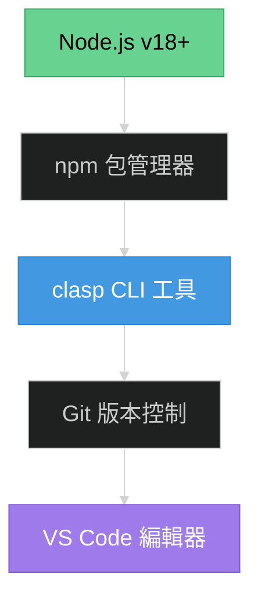
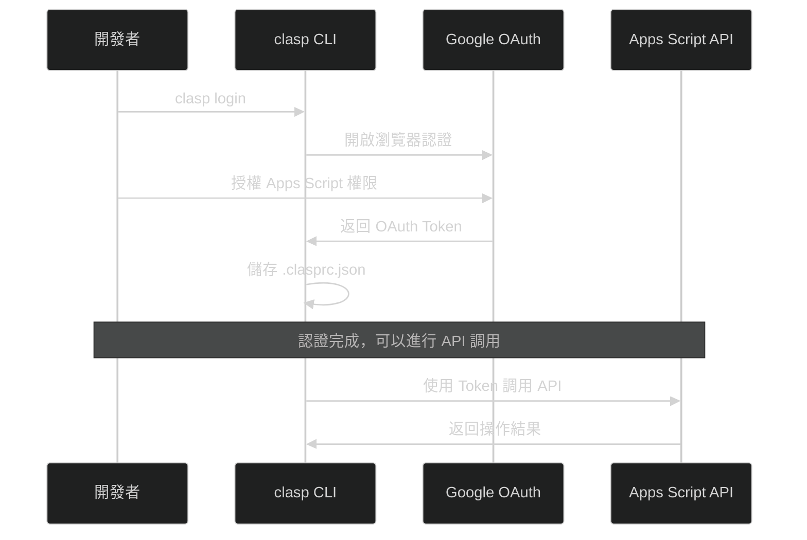
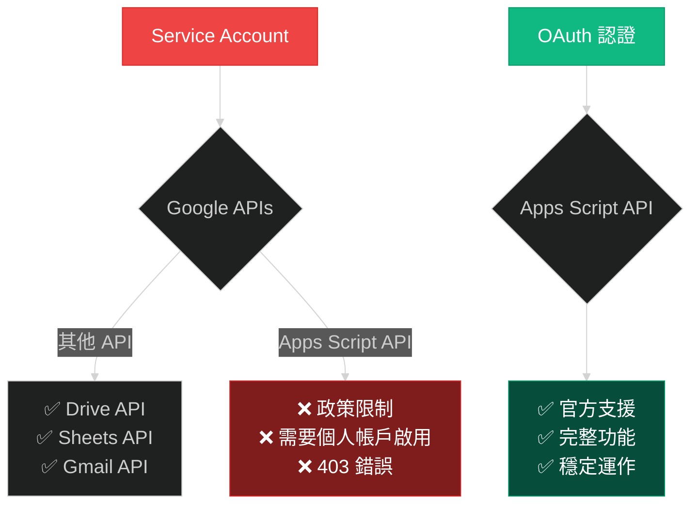

# 🔧 基礎篇：環境準備與核心概念

## 🎯 本篇學習目標

完成本篇後，您將：
- ✅ 準備好所有必需的開發環境
- ✅ 理解 GitHub Actions + Apps Script 的核心概念
- ✅ 掌握關鍵配置檔案的作用
- ✅ 具備開始實戰的基礎知識

## 📋 環境準備清單

### 🌐 線上帳戶需求

| 服務 | 必要性 | 用途 | 註冊網址 |
|------|-------|------|----------|
| **GitHub** | ✅ 必需 | 代碼託管、CI/CD | https://github.com |
| **Google 帳戶** | ✅ 必需 | Apps Script、API 使用 | https://accounts.google.com |
| **Google Cloud Console** | ⚠️ 可選 | Service Account (不推薦) | https://console.cloud.google.com |

### 💻 本地工具需求

#### Windows 環境 (推薦)



#### 必需工具安裝

| 工具 | 版本要求 | 安裝命令 | 驗證命令 |
|------|---------|----------|----------|
| **Node.js** | v18+ | [官網下載](https://nodejs.org) | `node --version` |
| **npm** | 自動安裝 | 包含在 Node.js 中 | `npm --version` |
| **clasp** | 最新版 | `npm install -g @google/clasp` | `clasp --version` |
| **Git** | v2.0+ | [官網下載](https://git-scm.com) | `git --version` |

#### 可選工具

| 工具 | 用途 | 安裝方式 |
|------|------|----------|
| **VS Code** | 代碼編輯器 | [官網下載](https://code.visualstudio.com) |
| **jq** | JSON 處理 | Windows: `winget install jqlang.jq` |
| **curl** | API 測試 | 通常已內建 |

### 🔧 環境驗證腳本

建立一個快速驗證腳本來檢查環境：

```cmd
@echo off
echo 🔧 環境檢查腳本
echo ==================

echo 📋 檢查 Node.js...
node --version
if %errorlevel% neq 0 (
    echo ❌ Node.js 未安裝
    exit /b 1
) else (
    echo ✅ Node.js 已安裝
)

echo 📋 檢查 npm...
npm --version
if %errorlevel% neq 0 (
    echo ❌ npm 未安裝
    exit /b 1
) else (
    echo ✅ npm 已安裝
)

echo 📋 檢查 clasp...
clasp --version
if %errorlevel% neq 0 (
    echo ❌ clasp 未安裝，正在安裝...
    npm install -g @google/clasp@latest
) else (
    echo ✅ clasp 已安裝
)

echo 📋 檢查 Git...
git --version
if %errorlevel% neq 0 (
    echo ❌ Git 未安裝
    exit /b 1
) else (
    echo ✅ Git 已安裝
)

echo ==================
echo 🎉 環境檢查完成！
```

## 🏗️ 核心架構理解

### 整體流程架構

```mermaid
%%{init: {'theme': 'dark', 'themeVariables': { 'fontSize': '20px', 'fontFamily': 'Arial' }}}%%
graph LR
    subgraph "開發環境"
        A[本地代碼]
        B[git push]
    end
    
    subgraph "GitHub"
        C[Repository]
        D[GitHub Actions]
        E[Secrets 管理]
    end
    
    subgraph "Google 生態"
        F[Apps Script API]
        G[OAuth 認證]
        H[Apps Script 專案]
    end
    
    A -->|推送| B
    B --> C
    C -->|觸發| D
    E -->|提供認證| D
    D -->|OAuth Token| G
    G -->|API 調用| F
    F -->|更新檔案| H
    
    style A fill:#1f2937,stroke:#3b82f6
    style D fill:#1f2937,stroke:#10b981
    style H fill:#1f2937,stroke:#f59e0b
```



### 關鍵組件說明

#### 1. GitHub Actions Workflow

**檔案位置**：`.github/workflows/deploy-to-gas.yml`

**核心職責**：
- 監聽代碼推送事件
- 設置 Node.js 環境
- 安裝 clasp CLI
- 使用 OAuth 認證
- 推送檔案到 Apps Script

#### 2. clasp CLI 工具

**官方文檔**：https://developers.google.com/apps-script/guides/clasp

**主要命令**：
```cmd
clasp login          # OAuth 認證登入
clasp list           # 列出可存取的專案
clasp push --force   # 強制推送檔案
clasp status         # 檢查連接狀態
```

#### 3. Apps Script 專案

**檔案類型對應**：

| 本地檔案 | Apps Script 類型 | 說明 |
|---------|------------------|------|
| `*.gs` | Server-side JavaScript | 後端邏輯 |
| `*.html` | HTML | 前端模板 |
| `appsscript.json` | Project Manifest | 專案配置 |

### 認證機制深度解析

#### OAuth 認證流程



#### OAuth vs Service Account 對比

| 認證方式 | OAuth | Service Account |
|---------|-------|-----------------|
| **設置複雜度** | ⭐⭐ 簡單 | ⭐⭐⭐⭐⭐ 複雜 |
| **Apps Script 支援** | ✅ 官方支援 | ❌ 政策限制 |
| **Token 生命週期** | 1小時 (可刷新) | 長期有效 |
| **適用場景** | CI/CD 部署 | 其他 Google API |
| **實施成功率** | 100% | 0% (Apps Script) |

## 📁 關鍵配置檔案詳解

### 1. .clasp.json (專案配置)

**作用**：告訴 clasp 要操作哪個 Apps Script 專案

```json
{
  "scriptId": "1KNf1rs_y00guMps1234567812345678Ah12345678y-lrQAhUE91axHJ",
  "rootDir": ".",
  "scriptExtensions": [".js", ".gs"],
  "htmlExtensions": [".html"],
  "jsonExtensions": [".json"],
  "filePushOrder": [],
  "skipSubdirectories": false
}
```

**重要欄位說明**：

| 欄位 | 說明 | 範例值 |
|------|------|--------|
| `scriptId` | Apps Script 專案唯一識別碼 | `1KNf1rs...` |
| `rootDir` | 本地檔案根目錄 | `"."` |
| `scriptExtensions` | 後端腳本副檔名 | `[".gs"]` |
| `htmlExtensions` | 前端檔案副檔名 | `[".html"]` |

**⚠️ 常見錯誤**：Script ID 不正確導致推送到錯誤專案

### 2. .clasprc.json (認證檔案)

**作用**：儲存 OAuth 認證資訊

**檔案位置**：`~/.clasprc.json` (使用者目錄)

```json
{
  "access_token": "ya12.a3AfB_byD1234567890123456789012345678901234567890...",
  "refresh_token": "1//04vr1234567890123456789012345678901234567890123456...",
  "scope": "https://www.googleapis.com/auth/script.projects...",
  "token_type": "Bearer",
  "expiry_date": 1234567890123
}
```

**重要說明**：
- 🔒 **敏感檔案**：絕不能提交到 Git
- ⏰ **會過期**：access_token 約 1 小時過期
- 🔄 **可刷新**：refresh_token 用於自動更新
- 🌐 **CI/CD 使用**：完整內容需放入 GitHub Secrets

### 3. GitHub Actions Workflow

**檔案位置**：`.github/workflows/deploy-to-gas.yml`

**基本結構**：

```yaml
name: Deploy to Google Apps Script

on:
  push:
    branches: [ main ]
  workflow_dispatch:

jobs:
  deploy:
    runs-on: ubuntu-latest
    steps:
      - name: Checkout repository
        uses: actions/checkout@v4
      
      - name: Setup Node.js
        uses: actions/setup-node@v4
        with:
          node-version: '18'
      
      - name: Install clasp
        run: npm install -g @google/clasp@latest
      
      - name: Setup OAuth Authentication
        run: |
          echo '${{ secrets.CLASPRC_JSON }}' > ~/.clasprc.json
      
      - name: Push files to Google Apps Script
        run: clasp push --force
```

### 4. GitHub Secrets 配置

**必需的 Secrets**：

| Secret 名稱 | 用途 | 取得方式 |
|-------------|------|----------|
| **CLASPRC_JSON** | OAuth 認證資訊 | 本地執行 `clasp login` 後複製 `~/.clasprc.json` 內容 |

**設置路徑**：GitHub Repository → Settings → Secrets and variables → Actions

## 🔍 概念深度理解

### Apps Script API 特殊性

#### 為什麼 Service Account 不適用？



**技術原因分析**：

1. **政策限制**：Apps Script API 要求個人帳戶啟用，與 Service Account 的無人化概念衝突
2. **安全考量**：Google 認為 Apps Script 需要明確的用戶授權
3. **歷史因素**：Apps Script 原本設計用於個人開發，CI/CD 支援是後來補充

### clasp CLI 工作原理

#### 檔案同步機制

```mermaid
%%{init: {'theme': 'dark', 'themeVariables': { 'fontSize': '20px', 'fontFamily': 'Arial' }}}%%
graph LR
    subgraph "本地檔案系統"
        A[code.gs]
        B[index.html]
        C[appsscript.json]
    end
    
    subgraph "clasp CLI"
        D[檔案掃描]
        E[類型判斷]
        F[API 調用]
    end
    
    subgraph "Apps Script 專案"
        G[Server JS: code]
        H[HTML: index]
        I[JSON: appsscript]
    end
    
    A --> D
    B --> D
    C --> D
    D --> E
    E --> F
    F --> G
    F --> H
    F --> I
    
    style D fill:#1f2937,stroke:#3b82f6
    style F fill:#1f2937,stroke:#10b981
```



#### 推送策略

| 選項 | 命令 | 行為 | 適用場景 |
|------|------|------|----------|
| **標準推送** | `clasp push` | 增量更新，需確認 | 開發階段 |
| **強制推送** | `clasp push --force` | 完全覆蓋，不需確認 | CI/CD 自動化 |
| **監控模式** | `clasp push --watch` | 即時同步，開發用 | 本地開發 |

### GitHub Actions 執行環境

#### 運行時特性

| 特性 | 說明 | 影響 |
|------|------|------|
| **臨時環境** | 每次執行都是全新容器 | 無狀態，需重新設置認證 |
| **Ubuntu 系統** | 基於 Linux 環境 | 路徑和指令與 Windows 不同 |
| **網路存取** | 可連接外部 API | 支援 Google API 調用 |
| **執行時限** | 單次最多 6 小時 | 一般部署幾分鐘內完成 |

## 🎯 實戰準備檢查清單

### 環境準備確認

在進入實戰篇之前，請確認以下項目：

#### ✅ 基礎環境

- [ ] Node.js v18+ 已安裝並可正常使用
- [ ] npm 包管理器運作正常
- [ ] clasp CLI 已全域安裝
- [ ] Git 版本控制已設置
- [ ] VS Code 或其他編輯器已準備

#### ✅ 帳戶準備

- [ ] GitHub 帳戶已註冊並登入
- [ ] Google 帳戶已準備 (建議使用專案專用帳戶)
- [ ] 已在 https://script.google.com/home/usersettings 啟用 Apps Script API

#### ✅ 專案準備

- [ ] GitHub repository 已建立
- [ ] 本地 Git repository 已初始化
- [ ] Apps Script 專案已建立 (或準備建立)
- [ ] 專案的 Script ID 已取得

#### ✅ 權限準備

- [ ] Google 帳戶對 Apps Script 專案有編輯權限
- [ ] GitHub repository 有 Actions 執行權限
- [ ] 了解 GitHub Secrets 的設置位置

### 概念理解確認

請確認您已理解以下核心概念：

#### ✅ 技術概念

- [ ] 理解 OAuth 認證與 Service Account 的差異
- [ ] 了解 clasp CLI 的基本用途
- [ ] 明白 GitHub Actions 的執行流程
- [ ] 知道 Apps Script API 的特殊限制

#### ✅ 檔案結構

- [ ] 了解 `.clasp.json` 的作用和重要性
- [ ] 理解 `.clasprc.json` 的敏感性
- [ ] 明白 GitHub Actions workflow 的基本結構
- [ ] 知道各種檔案類型在 Apps Script 中的對應

#### ✅ 安全認知

- [ ] 知道不能將認證檔案提交到 Git
- [ ] 理解 GitHub Secrets 的重要性
- [ ] 明白 Token 過期的處理方式
- [ ] 了解權限最小化原則

## 🚀 下一步行動

恭喜！您已經完成了基礎篇的學習。現在您應該：

1. **✅ 擁有完整的開發環境**
2. **✅ 理解核心技術概念**
3. **✅ 準備好實戰所需的帳戶和權限**

### 推薦下一步

根據您的情況選擇：

- **🚀 準備好實戰？** → [03_實戰篇：逐步實施指南](./03_實戰篇_逐步實施指南.md)
- **⚠️ 想先了解常見錯誤？** → [04_避坑篇：常見錯誤與解決](./04_避坑篇_常見錯誤與解決.md)
- **🔍 想深入了解故障排除？** → [05_故障排除篇：診斷與修復](./05_故障排除篇_診斷與修復.md)

### 快速回顧

如果需要回顧任何概念，可以參考：

- **📖 整體架構** → [01_概覽篇](./01_概覽篇_架構理解與路線圖.md)
- **🔧 環境問題** → 本篇相關章節
- **💡 概念疑問** → 本篇核心概念章節

---

**📝 學習進度追蹤**
- ✅ 01_概覽篇：架構理解與路線圖
- ✅ 02_基礎篇：環境準備與核心概念
- ⏳ 03_實戰篇：逐步實施指南
- ⏳ 04_避坑篇：常見錯誤與解決
- ⏳ 05_故障排除篇：診斷與修復指南
- ⏳ 06_進階篇：最佳實踐與優化

**🎯 下一個里程碑**：完成第一個成功的自動部署！
