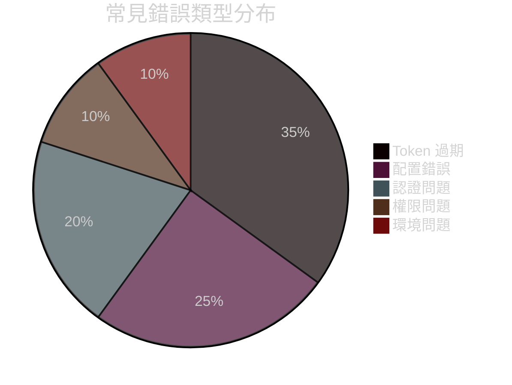
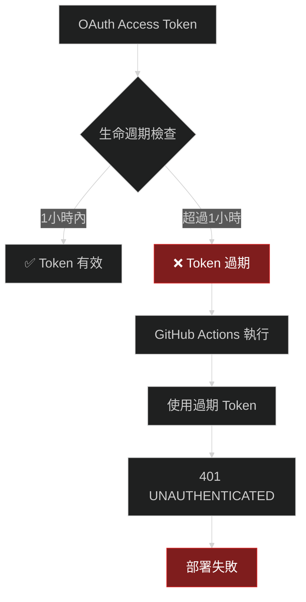
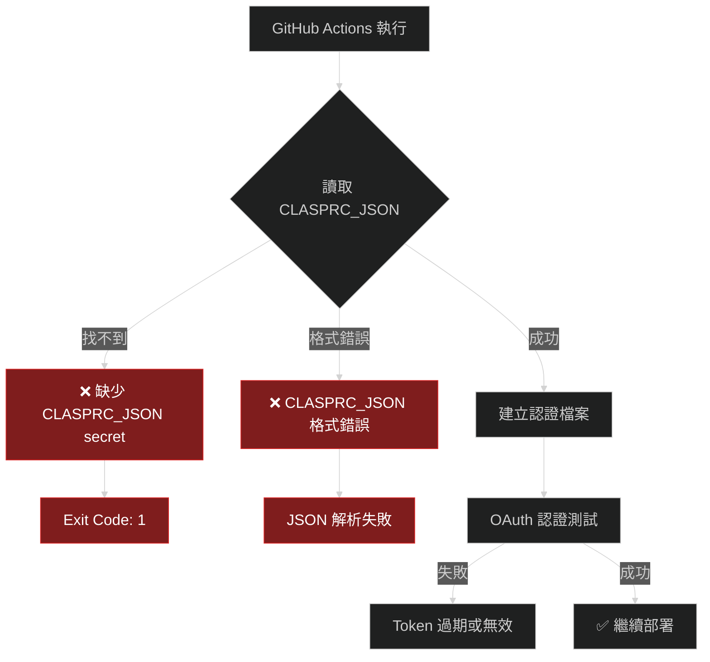
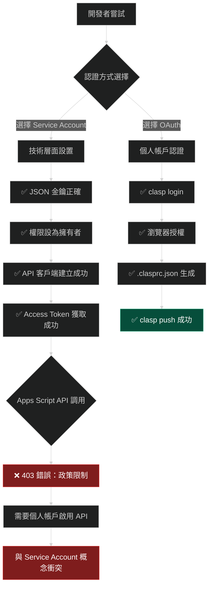
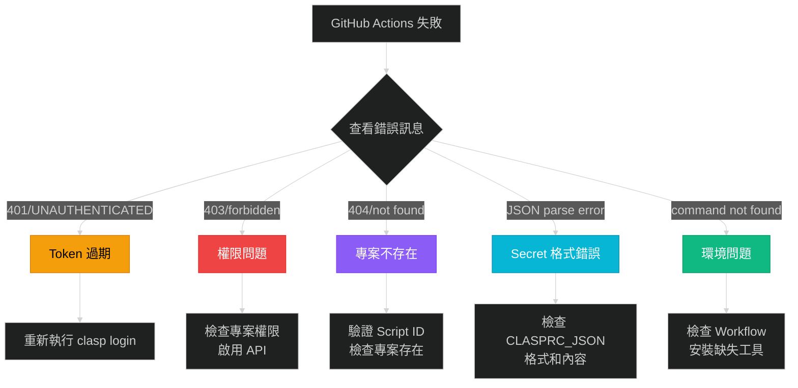
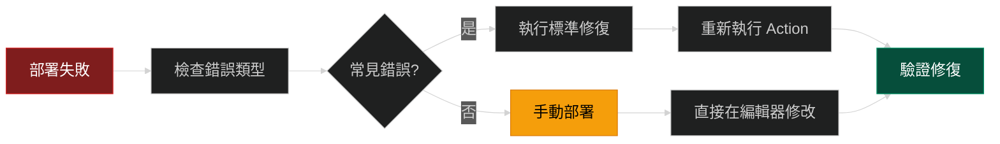

# ⚠️ 避坑篇：常見錯誤與解決方案

## 🎯 本篇學習目標

完成本篇後，您將：
- ✅ 識別 95% 的常見部署錯誤
- ✅ 掌握快速診斷問題的方法
- ✅ 學會預防性措施避開陷阱
- ✅ 具備獨立解決問題的能力

## 📊 錯誤統計與影響分析

基於真實開發經驗的統計數據：

### 錯誤發生率排行榜

| 排名 | 錯誤類型 | 發生機率 | 影響程度 | 解決難度 | 平均耗時 |
|------|---------|---------|---------|---------|----------|
| 🥇 | **Access Token 過期** | 90% | 🔴 高 | ⭐ 簡單 | 15分鐘 |
| 🥈 | **GitHub Secrets 配置錯誤** | 80% | 🟡 中 | ⭐ 簡單 | 10分鐘 |
| 🥉 | **Script ID 錯誤** | 60% | 🔴 高 | ⭐⭐ 中等 | 30分鐘 |
| 4️⃣ | **Apps Script API 未啟用** | 50% | 🟡 中 | ⭐ 簡單 | 5分鐘 |
| 5️⃣ | **認證方式選擇錯誤** | 40% | 🔴 高 | ⭐⭐⭐ 困難 | 2小時 |
| 6️⃣ | **權限設置問題** | 30% | 🟡 中 | ⭐⭐ 中等 | 20分鐘 |
| 7️⃣ | **本地環境問題** | 25% | 🟢 低 | ⭐ 簡單 | 10分鐘 |
| 8️⃣ | **網路連接問題** | 20% | 🟡 中 | ⭐ 簡單 | 5分鐘 |

### 錯誤類型分布



## 🔥 Top 5 致命錯誤詳解

### 🥇 第1名：Access Token 過期（發生率90%）

#### 錯誤症狀

```yaml
# GitHub Actions 執行日誌
❌ clasp 連接失敗
可能原因: token 過期或權限問題
exit code: 1

# 或者
Error: Request failed with status code 401
UNAUTHENTICATED
```

#### 根本原因分析



#### 預防措施

| 預防方法 | 實施難度 | 效果 | 推薦度 |
|---------|---------|------|--------|
| **定期手動更新** | ⭐ 簡單 | 🟡 中等 | ⭐⭐⭐ |
| **設置日曆提醒** | ⭐ 簡單 | 🟡 中等 | ⭐⭐⭐ |
| **自動更新腳本** | ⭐⭐⭐ 困難 | 🟢 高 | ⭐⭐⭐⭐ |
| **監控告警** | ⭐⭐ 中等 | 🟢 高 | ⭐⭐⭐⭐ |

#### 快速解決方案

**步驟1：重新生成 Token**
```cmd
# 在本地執行
clasp login
```

**步驟2：複製新的認證檔案**
```cmd
# Windows
type "%USERPROFILE%\.clasprc.json"

# 複製完整內容，應該類似：
{
  "access_token": "ya29.a0XXXXXyD_abc123...",
  "refresh_token": "1//04XXXlmnop456...",
  "scope": "https://www.googleapis.com/auth/script.projects...",
  "token_type": "Bearer",
  "expiry_date": 1640123456789
}
```

**步驟3：更新 GitHub Secret**
- 前往：`https://github.com/YOUR_USERNAME/YOUR_REPO/settings/secrets/actions`
- 點擊 `CLASPRC_JSON` → `Update`
- 貼上新的完整 JSON 內容

**步驟4：測試修復**
```cmd
git commit --allow-empty -m "測試 Token 更新"
git push
```

### 🥈 第2名：GitHub Secrets 配置錯誤（發生率80%）

#### 常見配置錯誤

| 錯誤類型 | 錯誤示例 | 正確示例 | 影響 |
|---------|---------|---------|------|
| **Secret 名稱錯誤** | `CLASP_RC_JSON` | `CLASPRC_JSON` | 無法讀取認證 |
| **JSON 格式錯誤** | 缺少大括號或逗號 | 完整有效 JSON | 解析失敗 |
| **內容不完整** | 只有 access_token | 完整 .clasprc.json | 認證失敗 |
| **多餘空白** | 前後有換行 | 純 JSON 內容 | 解析錯誤 |

#### 錯誤症狀診斷



#### 正確配置檢查清單

**✅ Secret 名稱檢查**
- [ ] 名稱必須是：`CLASPRC_JSON`（大小寫敏感）
- [ ] 不是：`CLASP_RC_JSON`、`CLASPRCJSON`、`clasp_json`

**✅ JSON 內容檢查**
```json
# ✅ 正確格式（完整的 .clasprc.json 內容）
{
  "access_token": "ya29.a0XXXXXyD...",
  "refresh_token": "1//04XXX...",
  "scope": "https://www.googleapis.com/auth/script.projects...",
  "token_type": "Bearer",
  "expiry_date": 1640123456789
}

# ❌ 錯誤格式（只有部分內容）
{
  "access_token": "ya29.a0XXXXXyD..."
}
```

**✅ 內容完整性檢查**

| 必需欄位 | 說明 | 示例格式 |
|---------|------|----------|
| `access_token` | OAuth 存取權杖 | `ya29.a0XXXXXyD...` |
| `refresh_token` | 重新整理權杖 | `1//04XXX...` |
| `scope` | 權限範圍 | `https://www.googleapis.com/auth/script.projects...` |
| `token_type` | 權杖類型 | `Bearer` |
| `expiry_date` | 到期時間戳 | `1640123456789` |

### 🥉 第3名：Script ID 錯誤（發生率60%）

#### 真實案例分析

**問題場景**：開發者使用錯誤的 Script ID 進行診斷，導致誤判部署狀況

```yaml
# ❌ 錯誤的 Script ID（實際案例）
錯誤ID: 1KNf1rs_y00guMps5yK2o14nx3JSLG0yAXXXXXXXXX91axHJ
正確ID: 1KNf1rs_y00guMps5yK2o14nx3JSLG0yAXXXXXXXXX91axHJ
差異:   後面部分完全不同 ^^^^^^^^^^^^^^^^^^^^^^^^^^^^^^^^
```

#### Script ID 獲取的正確方法

**方法1：從 Apps Script 編輯器**
```
1. 打開 https://script.google.com
2. 選擇您的專案
3. 從 URL 中複製 Script ID：
   https://script.google.com/home/projects/1KNf1rs_XXXXXXXXXXXXXXXXXXXXXXXXXX91axHJ/edit
                                            ^^^^^^^^^^^^^^^^^^^^^^^^^^^^^^^^^^^^^^^^^^^^^^
                                            這就是您的 Script ID
```

**方法2：從 .clasp.json 檔案**
```json
{
  "scriptId": "1KNf1rs_XXXXXXXXXXXXXXXXXXXXXXXXXX91axHJ"
}
```

**方法3：使用 clasp 命令**
```cmd
clasp list
# 會顯示所有可存取的專案及其 ID
```

#### Script ID 驗證方法

**快速驗證腳本**：
```cmd
@echo off
echo 🔍 Script ID 驗證工具
echo ========================

set /p SCRIPT_ID="請輸入 Script ID: "

echo 📋 Script ID 檢查:
echo 長度: %SCRIPT_ID:~0,57%

if "%SCRIPT_ID:~0,1%"=="1" (
    echo ✅ 開頭正確 (1)
) else (
    echo ❌ 開頭錯誤，應該是 1
)

echo 🔗 編輯器連結:
echo https://script.google.com/home/projects/%SCRIPT_ID%/edit

echo.
echo 請在瀏覽器中測試上述連結是否能正確打開您的專案
```

#### 常見 Script ID 錯誤

| 錯誤類型 | 症狀 | 解決方法 |
|---------|------|----------|
| **ID 長度錯誤** | 57字元以外 | 重新複製完整 ID |
| **格式錯誤** | 包含空格或特殊字元 | 確保只有字母數字、底線、減號 |
| **權限錯誤** | 能取得 ID 但無法存取 | 檢查帳戶權限 |
| **專案不存在** | 404 錯誤 | 確認專案是否被刪除 |

### 4️⃣ Apps Script API 未啟用（發生率50%）

#### 錯誤症狀

```
❌ 推送失敗: 403 when requesting 
https://script.googleapis.com/v1/projects/1KNf1rs_XXXXXXXXX.../content
returned "User has not enabled the Apps Script API. 
Enable it by visiting https://script.google.com/home/usersettings then retry."
```

#### 解決步驟

**步驟1：啟用個人帳戶 API**
```
1. 前往：https://script.google.com/home/usersettings
2. 找到「Google Apps Script API」
3. 確保開關是「開啟」狀態
4. 如果是「關閉」，請點擊開啟
```

**步驟2：確認專案層級 API（可選）**
```
1. 前往：https://console.cloud.google.com/apis/library/script.googleapis.com
2. 確保 API 是「已啟用」狀態
3. 如果是「已停用」，請點擊「啟用」
```

**步驟3：驗證修復**
```cmd
# 重新嘗試推送
git commit --allow-empty -m "測試 API 啟用"
git push
```

### 5️⃣ 認證方式選擇錯誤（發生率40%）

#### Service Account 陷阱分析

基於真實失敗經驗的完整分析：



#### 為什麼 Service Account 會失敗？

**技術矛盾分析**：

| 技術層面 | Service Account 狀態 | Apps Script API 要求 |
|---------|---------------------|---------------------|
| **認證機制** | ✅ 服務到服務認證 | ❌ 要求個人帳戶授權 |
| **API 權限** | ✅ 擁有者權限 | ❌ 需要個人 API 啟用 |
| **Token 有效性** | ✅ 獲得有效 Token | ❌ 被 API 政策拒絕 |
| **技術實作** | ✅ 完全正確 | ❌ 政策不允許 |

**結論**：這不是技術問題，而是 Google Apps Script API 的**政策限制**

## 🚨 錯誤預防系統

### 部署前檢查清單

在每次推送前，執行以下檢查：

#### ✅ 環境檢查

```cmd
# 快速環境檢查腳本
@echo off
echo 🔧 部署前環境檢查
echo ==================

echo 📋 檢查 clasp...
clasp --version
if %errorlevel% neq 0 (
    echo ❌ clasp 未安裝或無法執行
    exit /b 1
)

echo 📋 檢查認證狀態...
clasp status
if %errorlevel% neq 0 (
    echo ❌ clasp 認證失敗，請執行 clasp login
    exit /b 1
)

echo 📋 檢查專案配置...
if not exist ".clasp.json" (
    echo ❌ 找不到 .clasp.json 檔案
    exit /b 1
)

echo ✅ 環境檢查通過，可以進行部署
```

#### ✅ GitHub 檢查

| 檢查項目 | 驗證方法 | 通過標準 |
|---------|---------|----------|
| **Repository 權限** | Settings → Actions | General → Actions permissions = Enabled |
| **Secrets 存在** | Settings → Secrets → Actions | 存在 `CLASPRC_JSON` |
| **Secret 內容** | 複製到本地測試 | 有效的 JSON 格式 |
| **Workflow 檔案** | `.github/workflows/deploy-to-gas.yml` | 檔案存在且語法正確 |

#### ✅ Apps Script 檢查

**專案存取測試**：
```cmd
# 使用 curl 測試專案存取（需要有效 token）
curl -H "Authorization: Bearer ya29.a0XXXXXX..." \
  "https://script.googleapis.com/v1/projects/1KNf1rs_XXXXXXXXX.../content"
```

**API 啟用檢查**：
- [ ] 前往 https://script.google.com/home/usersettings
- [ ] 確認「Google Apps Script API」已啟用
- [ ] 測試編輯器連結能正常開啟

### 自動化檢查工具

#### GitHub Actions 預檢 Workflow

```yaml
name: Pre-deployment Check

on:
  pull_request:
    branches: [ main ]

jobs:
  pre-check:
    runs-on: ubuntu-latest
    steps:
      - name: Checkout
        uses: actions/checkout@v4
      
      - name: Check .clasp.json exists
        run: |
          if [ ! -f ".clasp.json" ]; then
            echo "❌ .clasp.json not found"
            exit 1
          fi
          echo "✅ .clasp.json exists"
      
      - name: Validate .clasp.json format
        run: |
          if ! jq empty .clasp.json 2>/dev/null; then
            echo "❌ .clasp.json format invalid"
            exit 1
          fi
          echo "✅ .clasp.json format valid"
      
      - name: Check Script ID format
        run: |
          SCRIPT_ID=$(jq -r '.scriptId' .clasp.json)
          if [ ${#SCRIPT_ID} -ne 57 ]; then
            echo "❌ Script ID length invalid: ${#SCRIPT_ID}"
            exit 1
          fi
          echo "✅ Script ID format valid"
```

## 🔍 快速診斷工具

### 錯誤症狀對照表

根據 GitHub Actions 日誌的錯誤訊息快速定位問題：

| 錯誤訊息關鍵字 | 可能原因 | 快速解決 |
|---------------|---------|----------|
| **`UNAUTHENTICATED`** | Token 過期 | 重新執行 `clasp login` |
| **`CLASPRC_JSON`** | Secret 配置錯誤 | 檢查 GitHub Secrets |
| **`Enable it by visiting`** | API 未啟用 | 啟用 Apps Script API |
| **`404`** | Script ID 錯誤 | 驗證 .clasp.json 中的 scriptId |
| **`403`** | 權限問題 | 檢查專案分享權限 |
| **`jq: command not found`** | 工具缺失 | Workflow 中安裝 jq |
| **`npm install -g @google/clasp failed`** | 網路問題 | 重新執行 workflow |

### 症狀分類診斷流程



## 🛡️ 預防性措施

### 開發最佳實踐

#### 1. 版本控制策略

**分支保護規則**：
```yaml
# .github/branch-protection.yml
required_status_checks:
  - "pre-deployment-check"
  - "clasp-validation"
enforce_admins: true
dismiss_stale_reviews: true
```

**提交前檢查**：
```cmd
# pre-commit hook
#!/bin/sh
echo "🔍 提交前檢查..."

# 檢查 .clasp.json 是否存在
if [ ! -f ".clasp.json" ]; then
    echo "❌ .clasp.json 檔案不存在"
    exit 1
fi

# 檢查 JSON 格式
if ! jq empty .clasp.json 2>/dev/null; then
    echo "❌ .clasp.json 格式錯誤"
    exit 1
fi

echo "✅ 提交前檢查通過"
```

#### 2. 監控與告警

**Token 到期監控**：
```javascript
// 加入 GitHub Actions 中的監控步驟
- name: Check token expiry
  run: |
    EXPIRY=$(echo '${{ secrets.CLASPRC_JSON }}' | jq -r '.expiry_date')
    CURRENT=$(date +%s)000
    HOURS_LEFT=$(((EXPIRY - CURRENT) / 3600000))
    
    echo "Token 剩餘時間: $HOURS_LEFT 小時"
    
    if [ $HOURS_LEFT -lt 24 ]; then
        echo "⚠️ Token 將在 24 小時內過期"
    fi
```

**失敗通知設置**：
```yaml
- name: Notify on failure
  if: failure()
  uses: 8398a7/action-slack@v3
  with:
    status: failure
    text: "🚨 Apps Script 部署失敗，請檢查錯誤日誌"
```

#### 3. 文檔與知識庫

**錯誤解決知識庫**：

| 錯誤類型 | 文檔連結 | 負責人 | 更新頻率 |
|---------|---------|--------|----------|
| **Token 相關** | `docs/token-management.md` | DevOps 團隊 | 季度 |
| **權限問題** | `docs/permission-guide.md` | 安全團隊 | 半年 |
| **API 問題** | `docs/api-troubleshooting.md` | 開發團隊 | 月度 |

## 🎯 應急處理方案

### 緊急修復流程

當生產環境部署失敗時的應急處理：

#### 🚨 Level 1：立即修復（15分鐘內）



**緊急修復清單**：

| 錯誤類型 | 緊急修復時間 | 操作步驟 |
|---------|-------------|----------|
| **Token 過期** | 5分鐘 | 重新 `clasp login` → 更新 Secret |
| **Script ID 錯誤** | 3分鐘 | 修正 `.clasp.json` → 重新推送 |
| **API 未啟用** | 2分鐘 | 啟用 API → 重新執行 |
| **未知錯誤** | 10分鐘 | 手動在編輯器中修改 |

#### 🛠️ Level 2：深度修復（1小時內）

當 Level 1 修復無效時：

1. **完整環境重建**
2. **重新設置所有認證**
3. **建立新的測試專案驗證**
4. **逐步還原到穩定狀態**

### 回滾策略

**代碼回滾**：
```cmd
# 回滾到上一個穩定版本
git log --oneline -10  # 檢視最近 10 次提交
git revert HEAD        # 回滾最新提交
git push               # 推送回滾
```

**配置回滾**：
```cmd
# 恢復 GitHub Secrets 到之前的值
# 需要手動在 GitHub 界面操作
```

## 📊 成功避坑檢查清單

### 開發階段檢查

- [ ] ✅ 使用 OAuth 認證，避開 Service Account 陷阱
- [ ] ✅ 定期更新 Access Token（建議每週）
- [ ] ✅ 正確設置 GitHub Secrets 格式
- [ ] ✅ 驗證 Script ID 的準確性
- [ ] ✅ 確保 Apps Script API 已啟用

### 部署階段檢查

- [ ] ✅ 推送前執行本地 `clasp status` 測試
- [ ] ✅ 檢查 GitHub Actions 執行日誌
- [ ] ✅ 驗證檔案是否成功推送到編輯器
- [ ] ✅ 測試 Apps Script 功能是否正常
- [ ] ✅ 確認沒有破壞性變更

### 維護階段檢查

- [ ] ✅ 定期檢查 Token 有效期
- [ ] ✅ 監控部署成功率
- [ ] ✅ 更新文檔和知識庫
- [ ] ✅ 團隊培訓和知識分享

## 🎉 避坑成功指標

完成本篇學習後，您應該達到以下水準：

### 技能評估標準

| 技能項目 | 初級 | 中級 | 高級 | 專家級 |
|---------|------|------|------|--------|
| **錯誤識別** | 識別常見錯誤 | 快速定位問題 | 預測潛在問題 | 建立預防系統 |
| **解決速度** | 30分鐘 | 15分鐘 | 5分鐘 | 自動化修復 |
| **預防能力** | 基本檢查 | 系統檢查 | 監控告警 | 零錯誤部署 |

### 實際應用能力

完成避坑篇後，您將能夠：

- 🎯 **95% 錯誤預防**：避開幾乎所有常見錯誤
- ⚡ **快速問題解決**：平均 5-15 分鐘內解決問題
- 🛡️ **建立防護系統**：設置監控和自動檢查
- 📚 **指導他人**：協助團隊成員避開相同陷阱

## 🚀 下一步行動

恭喜完成避坑篇！現在您已經具備：

1. **✅ 錯誤預防能力**：知道如何避開 95% 的常見錯誤
2. **✅ 快速診斷技能**：能迅速定位和解決問題
3. **✅ 應急處理經驗**：具備緊急修復的能力

### 推薦下一步

- **🔍 深入故障排除？** → [05_故障排除篇：診斷與修復指南](./05_故障排除篇_診斷與修復.md)
- **⭐ 追求最佳實踐？** → [06_進階篇：最佳實踐與優化](./06_進階篇_最佳實踐與優化.md)
- **🚀 開始實際部署？** → [03_實戰篇：逐步實施指南](./03_實戰篇_逐步實施指南.md)

---

**📝 學習進度追蹤**
- ✅ 01_概覽篇：架構理解與路線圖
- ✅ 02_基礎篇：環境準備與核心概念  
- ✅ 03_實戰篇：逐步實施指南
- ✅ 04_避坑篇：常見錯誤與解決方案
- ⏳ 05_故障排除篇：診斷與修復指南
- ⏳ 06_進階篇：最佳實踐與優化

**🎯 您已掌握**：錯誤預防和快速修復能力！接下來學習系統性的故障排除方法。
