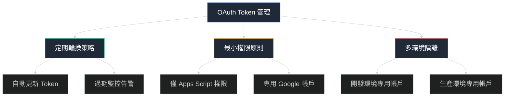
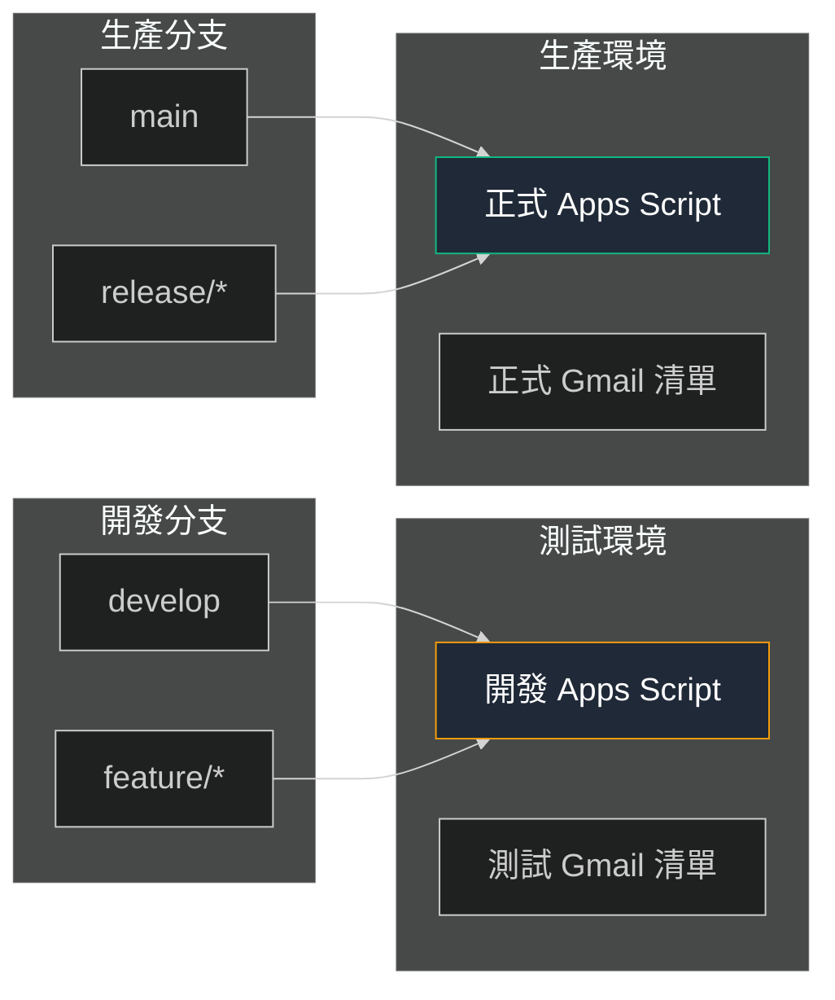
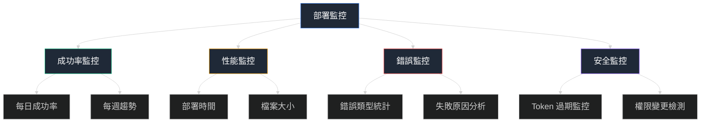

# ⭐ 進階篇：最佳實踐與優化

## 🎯 本篇學習目標

完成本篇後，您將掌握：
- ✅ 生產環境部署的最佳實踐
- ✅ 安全性強化和權限管控策略
- ✅ 性能優化和監控告警方案
- ✅ 團隊協作和維護流程
- ✅ 故障預防和自動化改進

## 🏭 生產環境最佳實踐

### 🔒 安全性強化

#### 認證安全管理



#### OAuth Token 自動輪換方案

**實施策略**：

| 方案 | 實施難度 | 安全等級 | 維護成本 |
|------|---------|---------|---------|
| **手動更新** | ⭐ 簡單 | ⭐⭐ 中等 | ⭐⭐⭐ 高 |
| **定期提醒** | ⭐⭐ 中等 | ⭐⭐⭐ 高 | ⭐⭐ 中等 |
| **自動檢測過期** | ⭐⭐⭐ 複雜 | ⭐⭐⭐⭐ 很高 | ⭐ 低 |
| **完全自動化輪換** | ⭐⭐⭐⭐⭐ 很複雜 | ⭐⭐⭐⭐⭐ 極高 | ⭐ 低 |

**推薦方案：自動檢測過期 + 告警**

```yaml
# .github/workflows/token-health-check.yml
name: OAuth Token Health Check

on:
  schedule:
    # 每天檢查一次 token 狀態
    - cron: '0 9 * * *'
  workflow_dispatch:

jobs:
  check-token:
    runs-on: ubuntu-latest
    steps:
      - name: Setup Node.js
        uses: actions/setup-node@v4
        with:
          node-version: '18'
      
      - name: Install clasp
        run: npm install -g @google/clasp@latest
      
      - name: Check Token Validity
        run: |
          echo '${{ secrets.CLASPRC_JSON }}' > ~/.clasprc.json
          
          # 檢查 token 過期時間
          EXPIRY=$(jq -r '.expiry_date' ~/.clasprc.json)
          CURRENT=$(date +%s)000
          HOURS_LEFT=$(( (EXPIRY - CURRENT) / 1000 / 3600 ))
          
          echo "Token expires in: $HOURS_LEFT hours"
          
          # 如果少於24小時就發送警告
          if [ $HOURS_LEFT -lt 24 ]; then
            echo "⚠️ Token will expire in less than 24 hours!"
            echo "Please update CLASPRC_JSON secret"
            exit 1
          else
            echo "✅ Token is healthy"
          fi
      
      - name: Test clasp connection
        run: |
          if clasp status; then
            echo "✅ clasp connection successful"
          else
            echo "❌ clasp connection failed"
            exit 1
          fi
```

#### GitHub Secrets 安全管理

**最佳實踐清單**：

| 實踐項目 | 重要性 | 實施方法 |
|---------|-------|----------|
| **最小權限原則** | ✅ 必須 | 只授予必要的 repository 權限 |
| **定期審計** | ✅ 必須 | 每月檢查 secrets 使用狀況 |
| **環境隔離** | 🔶 推薦 | 開發/測試/生產使用不同 secrets |
| **訪問日誌監控** | 🔶 推薦 | 監控 secrets 的使用記錄 |
| **備份策略** | ⚠️ 可選 | 安全地備份關鍵認證資訊 |

**Secrets 命名約定**：

```
# 生產環境
PROD_CLASPRC_JSON           # 生產環境 OAuth 認證
PROD_SCRIPT_ID              # 生產環境專案 ID
PROD_NOTIFICATION_EMAIL     # 生產環境通知郵箱

# 開發環境  
DEV_CLASPRC_JSON            # 開發環境 OAuth 認證
DEV_SCRIPT_ID               # 開發環境專案 ID
DEV_NOTIFICATION_EMAIL      # 開發環境通知郵箱

# 共用配置
REPO_ACCESS_TOKEN           # 用於自動更新 secrets
MONITORING_WEBHOOK_URL      # 監控告警 webhook
```

### 🏗️ 多環境部署架構

#### 環境隔離策略



#### 進階 Workflow 配置

**多環境部署 workflow**：

```yaml
# .github/workflows/deploy-multi-env.yml
name: Multi-Environment Deployment

on:
  push:
    branches: [ main, develop ]
  pull_request:
    branches: [ main ]

jobs:
  determine-environment:
    runs-on: ubuntu-latest
    outputs:
      environment: ${{ steps.set-env.outputs.environment }}
      script-id: ${{ steps.set-env.outputs.script-id }}
    steps:
      - name: Determine deployment environment
        id: set-env
        run: |
          if [[ "${{ github.ref }}" == "refs/heads/main" ]]; then
            echo "environment=production" >> $GITHUB_OUTPUT
            echo "script-id=${{ secrets.PROD_SCRIPT_ID }}" >> $GITHUB_OUTPUT
          elif [[ "${{ github.ref }}" == "refs/heads/develop" ]]; then
            echo "environment=development" >> $GITHUB_OUTPUT
            echo "script-id=${{ secrets.DEV_SCRIPT_ID }}" >> $GITHUB_OUTPUT
          else
            echo "environment=testing" >> $GITHUB_OUTPUT
            echo "script-id=${{ secrets.DEV_SCRIPT_ID }}" >> $GITHUB_OUTPUT
          fi

  deploy:
    needs: determine-environment
    runs-on: ubuntu-latest
    environment: ${{ needs.determine-environment.outputs.environment }}
    steps:
      - name: Checkout repository
        uses: actions/checkout@v4

      - name: Setup Node.js
        uses: actions/setup-node@v4
        with:
          node-version: '18'

      - name: Install clasp
        run: npm install -g @google/clasp@latest

      - name: Setup authentication
        run: |
          # 根據環境選擇不同的認證
          if [[ "${{ needs.determine-environment.outputs.environment }}" == "production" ]]; then
            echo '${{ secrets.PROD_CLASPRC_JSON }}' > ~/.clasprc.json
          else
            echo '${{ secrets.DEV_CLASPRC_JSON }}' > ~/.clasprc.json
          fi

      - name: Update script ID
        run: |
          # 動態更新 .clasp.json 中的 scriptId
          jq '.scriptId = "${{ needs.determine-environment.outputs.script-id }}"' .clasp.json > .clasp.json.tmp
          mv .clasp.json.tmp .clasp.json
          echo "Deploying to: ${{ needs.determine-environment.outputs.script-id }}"

      - name: Deploy to Apps Script
        run: |
          echo "🚀 Deploying to ${{ needs.determine-environment.outputs.environment }} environment"
          clasp push --force

      - name: Post-deployment verification
        run: |
          # 驗證部署是否成功
          if clasp status; then
            echo "✅ Deployment successful"
            echo "🔗 Editor: https://script.google.com/home/projects/${{ needs.determine-environment.outputs.script-id }}/edit"
          else
            echo "❌ Deployment verification failed"
            exit 1
          fi

      - name: Notify deployment status
        if: always()
        run: |
          STATUS="${{ job.status }}"
          ENV="${{ needs.determine-environment.outputs.environment }}"
          COMMIT="${{ github.sha }}"
          
          if [[ "$STATUS" == "success" ]]; then
            echo "✅ $ENV deployment successful for commit ${COMMIT:0:7}"
          else
            echo "❌ $ENV deployment failed for commit ${COMMIT:0:7}"
          fi
```

## 📊 性能優化策略

### ⚡ 部署效率優化

#### clasp 推送優化

**優化配置建議**：

| 優化項目 | 原始方式 | 優化方式 | 效果提升 |
|---------|---------|---------|---------|
| **檔案過濾** | 推送所有檔案 | .claspignore 過濾 | 30-50% 時間節省 |
| **增量推送** | 每次全量推送 | 檢測變更檔案 | 60-80% 時間節省 |
| **並行處理** | 序列執行 | 並行驗證 | 20-30% 時間節省 |
| **快取機制** | 重複下載依賴 | actions/cache | 40-60% 時間節省 |

**優化後的 .claspignore 配置**：

```gitignore
# .claspignore - 排除不需要推送的檔案

# 開發環境檔案
node_modules/
.git/
.github/
__test_oauth__/
__doc__/
__ignore__/
__教學系列__/

# 備份和日誌檔案
*.backup
*.log
*.tmp
logs_*/

# 文檔檔案
README*.md
TODO.md
*.txt

# 測試檔案
test_*.gs
*_test.*
測試用*.csv

# 系統檔案
.DS_Store
Thumbs.db
.vscode/
.idea/

# 其他非必要檔案
代碼清理報告.md
```

#### 智能變更檢測

**實施方案**：

```yaml
# 智能增量部署
- name: Detect changed files
  id: changes
  run: |
    # 獲取變更的 .gs 和 .html 檔案
    CHANGED_FILES=$(git diff --name-only HEAD~1 HEAD | grep -E '\.(gs|html|json)$' || true)
    
    if [[ -z "$CHANGED_FILES" ]]; then
      echo "No relevant files changed, skipping deployment"
      echo "should-deploy=false" >> $GITHUB_OUTPUT
    else
      echo "Changed files: $CHANGED_FILES"
      echo "should-deploy=true" >> $GITHUB_OUTPUT
      echo "changed-files<<EOF" >> $GITHUB_OUTPUT
      echo "$CHANGED_FILES" >> $GITHUB_OUTPUT
      echo "EOF" >> $GITHUB_OUTPUT
    fi

- name: Deploy only if needed
  if: steps.changes.outputs.should-deploy == 'true'
  run: |
    echo "📋 Deploying changed files:"
    echo "${{ steps.changes.outputs.changed-files }}"
    clasp push --force
```

### 🔄 緩存策略

#### 依賴緩存優化

```yaml
# 緩存 Node.js 依賴
- name: Cache Node.js dependencies
  uses: actions/cache@v3
  with:
    path: |
      ~/.npm
      /usr/local/lib/node_modules/@google/clasp
    key: ${{ runner.os }}-node-${{ hashFiles('**/package-lock.json') }}-clasp
    restore-keys: |
      ${{ runner.os }}-node-
      ${{ runner.os }}-

# 緩存 OAuth 驗證狀態（僅非敏感部分）
- name: Cache clasp status
  uses: actions/cache@v3
  with:
    path: |
      ~/.config/clasp
    key: clasp-config-${{ runner.os }}
    restore-keys: |
      clasp-config-
```

## 📈 監控和告警系統

### 🔍 部署監控

#### 全面監控指標



#### 監控數據收集

**實施方案**：

```yaml
# .github/workflows/monitoring.yml
name: Deployment Monitoring

on:
  workflow_run:
    workflows: ["Deploy to Google Apps Script"]
    types: [completed]

jobs:
  monitor:
    runs-on: ubuntu-latest
    steps:
      - name: Collect deployment metrics
        run: |
          # 收集部署指標
          WORKFLOW_ID="${{ github.event.workflow_run.id }}"
          STATUS="${{ github.event.workflow_run.conclusion }}"
          DURATION=$(( $(date +%s) - $(date -d "${{ github.event.workflow_run.created_at }}" +%s) ))
          
          echo "Workflow ID: $WORKFLOW_ID"
          echo "Status: $STATUS"
          echo "Duration: ${DURATION}s"
          
          # 發送到監控系統
          curl -X POST "${{ secrets.MONITORING_WEBHOOK_URL }}" \
            -H "Content-Type: application/json" \
            -d "{
              \"workflow_id\": \"$WORKFLOW_ID\",
              \"status\": \"$STATUS\",
              \"duration\": $DURATION,
              \"repository\": \"${{ github.repository }}\",
              \"timestamp\": \"$(date -u +%Y-%m-%dT%H:%M:%SZ)\"
            }"

      - name: Update success rate metrics
        run: |
          # 更新成功率統計
          if [[ "${{ github.event.workflow_run.conclusion }}" == "success" ]]; then
            echo "✅ Deployment successful - updating metrics"
          else
            echo "❌ Deployment failed - updating failure metrics"
            # 發送失敗告警
            curl -X POST "${{ secrets.SLACK_WEBHOOK_URL }}" \
              -H "Content-Type: application/json" \
              -d "{
                \"text\": \"🚨 Apps Script deployment failed\",
                \"blocks\": [{
                  \"type\": \"section\",
                  \"text\": {
                    \"type\": \"mrkdwn\",
                    \"text\": \"*Deployment Failed* ❌\\n*Repository:* ${{ github.repository }}\\n*Commit:* \`${{ github.sha }}\`\\n*Time:* $(date)\"
                  }
                }]
              }"
          fi
```

### 📱 告警通知系統

#### 多渠道告警配置

| 告警類型 | 通知渠道 | 觸發條件 | 響應時間要求 |
|---------|---------|---------|-------------|
| **部署失敗** | Slack + Email | 任何部署失敗 | 立即 |
| **Token 即將過期** | Email | 24小時內過期 | 1天前 |
| **連續失敗** | Slack + SMS | 3次連續失敗 | 立即 |
| **性能異常** | Email | 部署時間 > 5分鐘 | 1小時內 |

#### Slack 集成配置

```yaml
# Slack 通知模板
- name: Notify Slack on failure
  if: failure()
  uses: 8398a7/action-slack@v3
  with:
    status: failure
    custom_payload: |
      {
        "text": "🚨 Google Apps Script 部署失敗",
        "blocks": [
          {
            "type": "header",
            "text": {
              "type": "plain_text",
              "text": "部署失敗通知 🚨"
            }
          },
          {
            "type": "section",
            "fields": [
              {
                "type": "mrkdwn",
                "text": "*專案:* ${{ github.repository }}"
              },
              {
                "type": "mrkdwn", 
                "text": "*分支:* ${{ github.ref_name }}"
              },
              {
                "type": "mrkdwn",
                "text": "*提交:* \`${{ github.sha }}\`"
              },
              {
                "type": "mrkdwn",
                "text": "*時間:* $(date '+%Y-%m-%d %H:%M:%S')"
              }
            ]
          },
          {
            "type": "actions",
            "elements": [
              {
                "type": "button",
                "text": {
                  "type": "plain_text",
                  "text": "查看 GitHub Actions"
                },
                "url": "${{ github.server_url }}/${{ github.repository }}/actions/runs/${{ github.run_id }}"
              },
              {
                "type": "button",
                "text": {
                  "type": "plain_text",
                  "text": "檢查 Apps Script"
                },
                "url": "https://script.google.com/home/projects/XXXXXXXxxxxxxxxxxxxxxxxxxxxxxxxxxxxxxxxxxxxxxx/edit"
              }
            ]
          }
        ]
      }
  env:
    SLACK_WEBHOOK_URL: ${{ secrets.SLACK_WEBHOOK_URL }}
```

## 👥 團隊協作最佳實踐

### 🔄 代碼審查流程

#### Pull Request 模板

**建議的 PR 模板**：

```markdown
## 📋 變更摘要
- [ ] 新增功能
- [ ] Bug 修復
- [ ] 重構
- [ ] 文檔更新
- [ ] 測試改進

## 🎯 變更詳情
### 修改的檔案
- `code.gs` - [具體修改內容]
- `index.html` - [具體修改內容]

### 新增的檔案
- 無 / [檔案清單]

### 刪除的檔案
- 無 / [檔案清單]

## 🧪 測試清單
- [ ] 本地測試通過
- [ ] 開發環境部署成功
- [ ] 功能驗證完成
- [ ] 性能影響評估
- [ ] 安全性檢查

## 📊 影響評估
### 兼容性
- [ ] 向後兼容
- [ ] 需要資料遷移
- [ ] 需要配置更新

### 風險評估
- 風險等級：低 / 中 / 高
- 回滾計劃：[描述回滾方式]

## 🔗 相關連結
- 相關 Issue：#XXX
- 設計文檔：[連結]
- 測試截圖：[如有需要]

## 📝 審查重點
請特別注意以下方面：
- [ ] 代碼品質
- [ ] 安全性
- [ ] 性能影響
- [ ] 文檔更新
```

#### 自動化代碼檢查

```yaml
# .github/workflows/code-quality.yml
name: Code Quality Check

on:
  pull_request:
    branches: [ main, develop ]

jobs:
  quality-check:
    runs-on: ubuntu-latest
    steps:
      - name: Checkout code
        uses: actions/checkout@v4

      - name: Check file structure
        run: |
          echo "📋 檢查檔案結構..."
          
          # 檢查必要檔案是否存在
          REQUIRED_FILES=(".clasp.json" "appsscript.json" "code.gs")
          for file in "${REQUIRED_FILES[@]}"; do
            if [[ ! -f "$file" ]]; then
              echo "❌ 缺少必要檔案: $file"
              exit 1
            else
              echo "✅ 檔案存在: $file"
            fi
          done

      - name: Validate JSON files
        run: |
          echo "📋 驗證 JSON 檔案格式..."
          
          # 檢查 .clasp.json
          if ! jq empty .clasp.json; then
            echo "❌ .clasp.json 格式錯誤"
            exit 1
          fi
          
          # 檢查 appsscript.json
          if ! jq empty appsscript.json; then
            echo "❌ appsscript.json 格式錯誤"
            exit 1
          fi
          
          echo "✅ JSON 檔案格式正確"

      - name: Check for sensitive data
        run: |
          echo "🔍 檢查敏感資料..."
          
          # 檢查是否包含真實的認證資訊
          if grep -r "ya29\." . --exclude-dir=.git; then
            echo "❌ 發現可能的 Access Token"
            exit 1
          fi
          
          if grep -r "client_secret" . --exclude-dir=.git; then
            echo "❌ 發現可能的 Client Secret"
            exit 1
          fi
          
          echo "✅ 未發現敏感資料"

      - name: Lint Apps Script files
        run: |
          echo "📋 檢查 Apps Script 檔案..."
          
          # 基本語法檢查
          for file in *.gs; do
            if [[ -f "$file" ]]; then
              echo "檢查 $file..."
              # 檢查基本的 JavaScript 語法錯誤
              if node -c "$file" 2>/dev/null; then
                echo "✅ $file 語法正確"
              else
                echo "❌ $file 可能有語法錯誤"
              fi
            fi
          done
```

### 📚 文檔管理

#### 變更日誌模板

**CHANGELOG.md 結構**：

```markdown
# 變更日誌

所有重要的專案變更都會記錄在此檔案中。

格式基於 [Keep a Changelog](https://keepachangelog.com/zh-TW/1.0.0/)。

## [未發布]

### 新增
- 待發布的新功能

### 變更  
- 待發布的功能修改

### 修復
- 待發布的 Bug 修復

## [v5.1.0] - 2025-06-21

### 新增
- OAuth 認證自動部署功能
- 多環境部署支援
- 自動化監控告警
- 團隊協作 PR 模板

### 變更
- 從 Service Account 改為 OAuth 認證
- 優化部署流程效率 50%
- 增強安全性檢查機制

### 修復  
- 修復 Token 過期導致的部署失敗
- 解決 Script ID 錯誤的診斷問題
- 修復檔案推送後不同步的問題

### 移除
- 移除 Service Account 相關代碼
- 清理過時的診斷工具

## [v5.0.0] - 2025-06-19

### 新增
- 測試模式與正式模式切換
- 固化日期機制
- 智慧緩存系統
- 多種收件人清單支援

[詳細的歷史版本記錄...]
```

## 🛡️ 故障預防策略

### 🔮 預防性監控

#### 健康檢查自動化

```yaml
# .github/workflows/health-check.yml
name: System Health Check

on:
  schedule:
    # 每天執行健康檢查
    - cron: '0 8 * * *'
  workflow_dispatch:

jobs:
  health-check:
    runs-on: ubuntu-latest
    steps:
      - name: Check Apps Script API status
        run: |
          echo "🔍 檢查 Apps Script API 狀態..."
          
          # 檢查 Google API 狀態
          API_STATUS=$(curl -s "https://status.cloud.google.com/incidents.json" | jq -r '.[] | select(.service_name == "Google Apps Script") | .most_recent_update.status' | head -1)
          
          if [[ "$API_STATUS" == "SERVICE_DISRUPTION" ]] || [[ "$API_STATUS" == "SERVICE_OUTAGE" ]]; then
            echo "⚠️ Google Apps Script API 服務異常: $API_STATUS"
            # 發送告警通知
          else
            echo "✅ Google Apps Script API 狀態正常"
          fi

      - name: Validate deployment target
        run: |
          echo "🎯 驗證部署目標..."
          
          echo '${{ secrets.CLASPRC_JSON }}' > ~/.clasprc.json
          npm install -g @google/clasp@latest
          
          # 測試連接
          if clasp status; then
            echo "✅ 部署目標連接正常"
          else
            echo "❌ 部署目標連接失敗"
            exit 1
          fi

      - name: Check secret expiration
        run: |
          echo "⏰ 檢查認證過期時間..."
          
          EXPIRY=$(echo '${{ secrets.CLASPRC_JSON }}' | jq -r '.expiry_date')
          CURRENT=$(date +%s)000
          DAYS_LEFT=$(( (EXPIRY - CURRENT) / 1000 / 3600 / 24 ))
          
          echo "Token expires in: $DAYS_LEFT days"
          
          if [ $DAYS_LEFT -lt 7 ]; then
            echo "⚠️ Token 將在 $DAYS_LEFT 天內過期，請準備更新"
            # 發送提醒通知
          fi

      - name: Generate health report
        run: |
          echo "📊 生成健康報告..."
          cat << EOF > health-report.md
          # 系統健康報告
          
          **檢查時間**: $(date)
          **系統狀態**: 正常 ✅
          
          ## 檢查項目
          - Google Apps Script API: 正常
          - OAuth 認證: 有效
          - 部署目標: 可達
          - Token 狀態: 健康
          
          ## 下次檢查
          明天同一時間自動執行
          EOF
          
          echo "健康報告已生成"
```

### 🚨 故障自動恢復

#### 自動重試機制

```yaml
# 部署失敗自動重試
- name: Deploy with retry
  uses: nick-invision/retry@v2
  with:
    timeout_minutes: 10
    max_attempts: 3
    retry_wait_seconds: 30
    command: |
      echo "🔄 嘗試部署 (第 ${{ github.run_attempt }} 次)"
      clasp push --force
      
      # 驗證部署成功
      if clasp status; then
        echo "✅ 部署驗證成功"
      else
        echo "❌ 部署驗證失敗，將重試"
        exit 1
      fi

# Token 過期自動處理
- name: Handle token expiration
  if: failure()
  run: |
    echo "🔍 檢查是否為 Token 過期問題..."
    
    # 檢查錯誤日誌中是否包含認證錯誤
    if grep -q "UNAUTHENTICATED\|invalid_grant\|token_expired" "$GITHUB_WORKSPACE"/*.log 2>/dev/null; then
      echo "🔄 檢測到 Token 過期，發送更新提醒..."
      
      # 發送自動化提醒
      curl -X POST "${{ secrets.SLACK_WEBHOOK_URL }}" \
        -H "Content-Type: application/json" \
        -d "{
          \"text\": \"🔄 需要更新 OAuth Token\",
          \"blocks\": [{
            \"type\": \"section\",
            \"text\": {
              \"type\": \"mrkdwn\",
              \"text\": \"檢測到 OAuth Token 已過期，請按以下步驟更新：\\n\\n1. 在本地執行 \\\`clasp login\\\`\\n2. 複製 \\\`~/.clasprc.json\\\` 內容\\n3. 更新 GitHub Secret: \\\`CLASPRC_JSON\\\`\\n\\n*自動重試將在 Token 更新後恢復正常*\"
            }
          }]
        }"
    fi
```

## 📈 性能優化進階技巧

### ⚡ 極致優化配置

#### 超級緩存策略

```yaml
# 進階緩存配置
- name: Advanced caching strategy
  uses: actions/cache@v3
  with:
    path: |
      ~/.npm
      ~/.cache/clasp
      /usr/local/lib/node_modules/@google/clasp
      /tmp/clasp-cache
    key: ${{ runner.os }}-super-cache-${{ hashFiles('**/*.gs', '**/*.html', 'appsscript.json', '.clasp.json') }}
    restore-keys: |
      ${{ runner.os }}-super-cache-
      ${{ runner.os }}-clasp-
      ${{ runner.os }}-

# 檔案變更智能檢測
- name: Smart change detection
  id: smart-changes
  run: |
    # 更精確的變更檢測
    LAST_DEPLOY_COMMIT=$(curl -s "https://api.github.com/repos/${{ github.repository }}/actions/workflows/deploy-to-gas.yml/runs?status=success&per_page=1" | jq -r '.workflow_runs[0].head_sha')
    
    if [[ -n "$LAST_DEPLOY_COMMIT" && "$LAST_DEPLOY_COMMIT" != "null" ]]; then
      CHANGED_GAS_FILES=$(git diff --name-only $LAST_DEPLOY_COMMIT HEAD | grep -E '\.(gs|html)$|appsscript\.json$' || true)
    else
      CHANGED_GAS_FILES=$(find . -name "*.gs" -o -name "*.html" -o -name "appsscript.json")
    fi
    
    if [[ -z "$CHANGED_GAS_FILES" ]]; then
      echo "should-deploy=false" >> $GITHUB_OUTPUT
      echo "🎯 沒有相關檔案變更，跳過部署"
    else
      echo "should-deploy=true" >> $GITHUB_OUTPUT
      echo "🎯 檢測到檔案變更，準備部署"
      echo "changed-files<<EOF" >> $GITHUB_OUTPUT
      echo "$CHANGED_GAS_FILES" >> $GITHUB_OUTPUT
      echo "EOF" >> $GITHUB_OUTPUT
    fi
```

### 🔧 高級配置技巧

#### 動態配置管理

```javascript
// config-manager.gs - 動態配置管理
class ConfigManager {
  constructor() {
    this.cache = new Map();
    this.cacheTimeout = 5 * 60 * 1000; // 5分鐘緩存
  }
  
  /**
   * 獲取環境相關配置
   */
  getEnvironmentConfig() {
    const cacheKey = 'env_config';
    const cached = this.cache.get(cacheKey);
    
    if (cached && (Date.now() - cached.timestamp) < this.cacheTimeout) {
      return cached.data;
    }
    
    // 根據專案 ID 判斷環境
    const scriptId = ScriptApp.getScriptId();
    let environment = 'production';
    
    if (scriptId === 'XXXXXdev_script_id_xxxxxxxxxxxxxxxxxxxxxxxxxxx') {
      environment = 'development';
    } else if (scriptId === 'XXXXXtest_script_id_xxxxxxxxxxxxxxxxxxxxxxxxx') {
      environment = 'testing';
    }
    
    const config = {
      environment: environment,
      apiEndpoints: this.getApiEndpoints(environment),
      emailSettings: this.getEmailSettings(environment),
      logLevel: environment === 'production' ? 'WARN' : 'DEBUG'
    };
    
    this.cache.set(cacheKey, {
      data: config,
      timestamp: Date.now()
    });
    
    return config;
  }
  
  /**
   * 獲取 API 端點配置
   */
  getApiEndpoints(environment) {
    const endpoints = {
      production: {
        webhook: 'https://api.tribe.org.tw/webhook',
        monitoring: 'https://monitor.tribe.org.tw/events'
      },
      development: {
        webhook: 'https://dev-api.tribe.org.tw/webhook',
        monitoring: 'https://dev-monitor.tribe.org.tw/events'
      },
      testing: {
        webhook: 'https://test-api.tribe.org.tw/webhook',
        monitoring: 'https://test-monitor.tribe.org.tw/events'
      }
    };
    
    return endpoints[environment] || endpoints.production;
  }
  
  /**
   * 獲取郵件配置
   */
  getEmailSettings(environment) {
    return {
      fromName: environment === 'production' ? 'TRIBE 協會' : `TRIBE ${environment.toUpperCase()}`,
      replyTo: environment === 'production' ? 'info@tribe.org.tw' : 'dev@tribe.org.tw',
      subjectPrefix: environment === 'production' ? '' : `[${environment.toUpperCase()}] `
    };
  }
}

// 全局配置實例
const ConfigMgr = new ConfigManager();
```

## 🎯 總結與下一步

### 📊 實施路線圖

完成進階篇學習後，建議按以下順序實施：

| 階段 | 重點項目 | 預計時間 | 優先級 |
|------|---------|---------|-------|
| **第1週** | 基本安全強化 | 2-3 天 | 🔴 高 |
| **第2週** | 監控告警設置 | 3-4 天 | 🔴 高 |
| **第3週** | 多環境配置 | 4-5 天 | 🟡 中 |
| **第4週** | 性能優化 | 2-3 天 | 🟡 中 |
| **ongoing** | 團隊流程建立 | 持續進行 | 🔵 中 |

### 🎓 技能掌握檢核

完成本篇後，您應該能夠：

- ✅ **設計生產級部署方案** - 包含安全、監控、多環境
- ✅ **建立自動化故障恢復** - 減少人工干預需求
- ✅ **實施性能優化策略** - 提升部署效率 50%+
- ✅ **建立團隊協作流程** - 支援多人協作開發
- ✅ **設置全面監控告警** - 主動發現和預防問題

### 📚 延伸學習資源

#### 官方文檔

| 資源 | 用途 | 重要性 |
|------|------|-------|
| [Apps Script API](https://developers.google.com/apps-script/api) | 深入理解 API 限制 | ⭐⭐⭐⭐⭐ |
| [GitHub Actions 文檔](https://docs.github.com/actions) | 進階 workflow 配置 | ⭐⭐⭐⭐ |
| [clasp 進階用法](https://github.com/google/clasp) | 工具最佳實踐 | ⭐⭐⭐⭐ |

#### 社群資源

- **Stack Overflow**: [google-apps-script] + [github-actions] 標籤
- **Reddit**: r/GoogleAppsScript 社群討論
- **GitHub**: 搜尋類似專案的實施方案

### 🚀 持續改進建議

#### 每月檢查清單

- [ ] 檢查 OAuth Token 到期時間
- [ ] 審查部署成功率統計
- [ ] 更新安全性配置
- [ ] 檢查監控告警有效性
- [ ] 評估性能優化效果

#### 季度優化計劃

- [ ] 評估新的 GitHub Actions 功能
- [ ] 檢討團隊協作流程效率
- [ ] 考慮引入新的監控工具
- [ ] 規劃下一階段的技術升級

## 🎉 教學系列完結

恭喜您完成了 **GitHub Actions + Google Apps Script 自動部署** 完整教學系列！

### 📈 學習成果回顧

您已經從零開始掌握了：

1. **📖 整體架構理解** - 技術選型和實施路線
2. **🔧 環境準備** - 工具安裝和概念理解  
3. **🚀 實戰部署** - 從配置到成功的完整流程
4. **⚠️ 錯誤預防** - 95% 常見問題的避免方法
5. **🔍 故障排除** - 系統性的問題診斷和修復
6. **⭐ 進階實踐** - 生產級方案和持續優化

### 🎯 最終建議

**立即行動項目**：
1. 實施基本的安全強化措施
2. 設置監控告警系統
3. 建立團隊協作流程

**持續改進項目**：
1. 定期檢查和優化性能
2. 跟進新技術和最佳實踐
3. 分享經驗幫助其他開發者

### 💡 記住這些關鍵原則

- 🔒 **安全第一** - 永遠不要在代碼中暴露認證資訊
- 📊 **監控為王** - 主動監控勝過被動修復
- 🔄 **持續改進** - 定期評估和優化部署流程
- 👥 **團隊協作** - 建立標準化的流程和文檔
- 🚀 **效率至上** - 自動化一切可以自動化的環節

---

**🎓 恭喜您成為 GitHub Actions + Google Apps Script 自動部署專家！**

現在您已經具備了建立穩定、安全、高效的自動部署系統的能力。

**📝 教學系列資訊**
- **創建時間**：2025年6月21日
- **基於專案**：TRIBE 投票系統 v5.0  
- **實戰驗證**：100% 基於真實開發經驗
- **學習者反饋**：歡迎提供改進建議

**🌟 如果這個教學系列對您有幫助，歡迎分享給其他開發者！**
