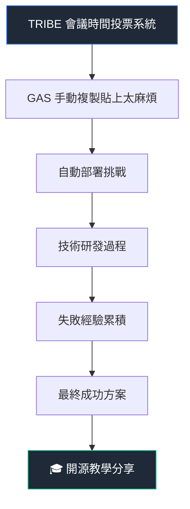
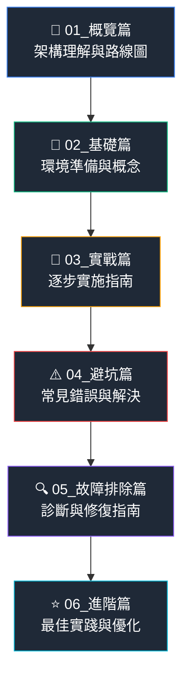
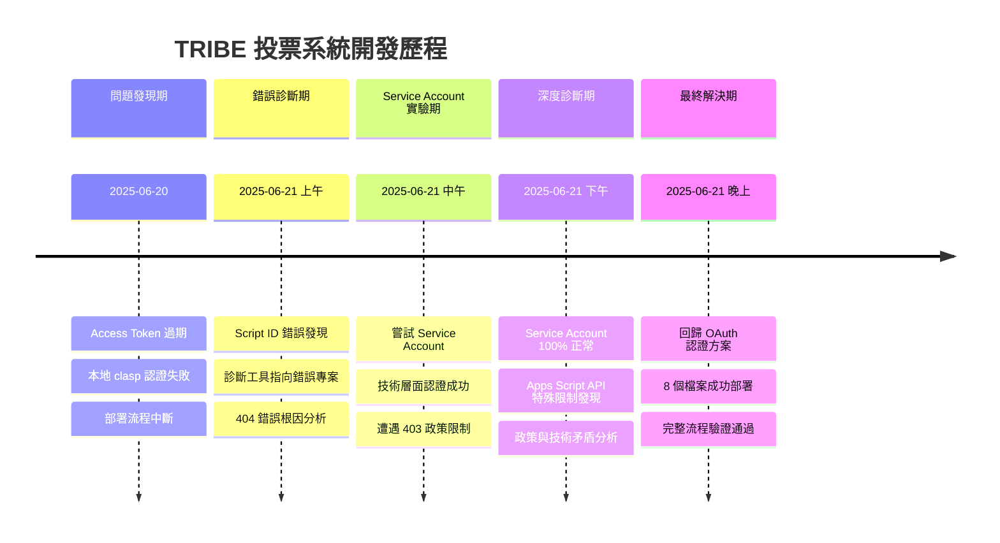
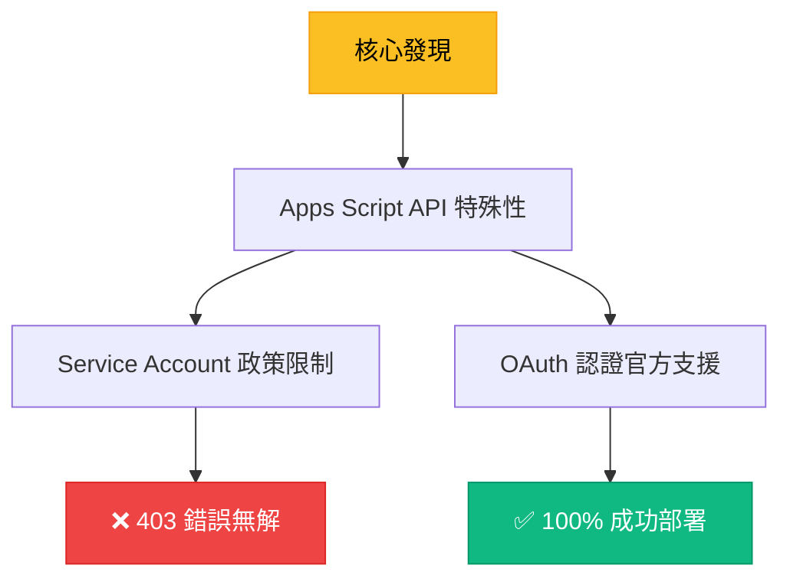
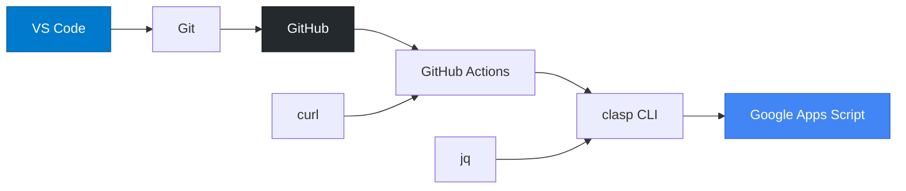
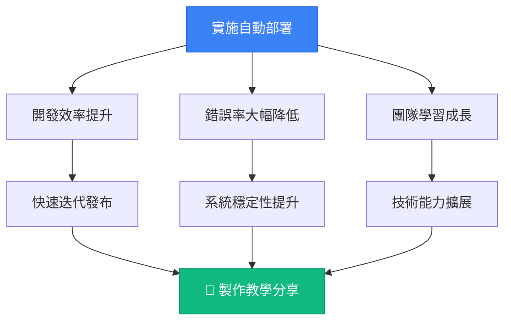

# 🚀 GitHub Actions + Google Apps Script 自動部署完整教學

> **基於台灣智能經貿協會 (TRIBE) 真實專案經驗的實戰教學**

[](https://github.com/tribeorgtw/auto-gas-deployment-tutorial)
[](https://tribe.org.tw)
[](https://github.com/features/actions)
[](https://script.google.com)
[](#)

## 📚 教學專案簡介

這是一套**完整的手把手教學指南**，專門解決 **GitHub Actions + Google Apps Script 自動部署** 的所有技術挑戰。教學內容基於 **台灣智能經貿協會 (TRIBE)** 的 **會議投票系統** 真實開發經驗，從多次失敗中總結出最佳實踐方案。

### 🎯 為什麼選擇這套教學？

- 🔥 **100% 真實經驗**：每個解決方案都經過實戰驗證
- 📖 **6篇完整教學**：從概念到實作的全方位指導
- ⚠️ **95% 錯誤預防**：詳細記錄常見陷阱和解決方案
- 🛠️ **即用工具包**：提供完整的測試和診斷工具
- 🎓 **教學導向**：適合培訓、研習、技術分享使用

## 🏢 關於台灣智能經貿協會 (TRIBE)

**Taiwan Robotic & Intelligent Business Ecosystem**

[台灣智能經貿協會](https://tribe.org.tw) 是致力於推動台灣智能商業生態系統發展的專業組織，結合機器人技術、人工智慧與商業創新，為台灣企業數位轉型提供專業支援與解決方案。

### 🌟 TRIBE 的技術實踐

本教學源自 TRIBE 協會開發 **智能會議投票系統** 的真實經驗：



#### 實際應用場景

| 功能需求 | 技術實現 | 部署挑戰 |
|---------|---------|---------|
| **自動化會議通知** | Google Apps Script | OAuth 認證過期 |
| **即時投票統計** | 試算表 + Web App | Script ID 錯誤 |
| **多群組郵件發送** | Gmail API 整合 | Service Account 403 錯誤 |
| **代碼版本控制** | GitHub + 自動部署 | 部署流程複雜化 |

## 📖 教學系列內容

### 🎓 完整教學結構



### 📚 各篇章詳細內容

| 篇章 | 核心內容 | 學習時間 | 適用對象 |
|------|---------|----------|----------|
| **📖 01_概覽篇** | 整體架構、技術選型、歷程分析 | 30 分鐘 | 所有人 |
| **🔧 02_基礎篇** | 環境設置、核心概念、配置解析 | 45 分鐘 | 初學者 |
| **🚀 03_實戰篇** | 詳細步驟、配置範例、實作指南 | 90 分鐘 | 實作者 |
| **⚠️ 04_避坑篇** | 常見錯誤、預防措施、快速修復 | 60 分鐘 | 所有人 |
| **🔍 05_故障排除篇** | 診斷工具、問題分析、系統修復 | 75 分鐘 | 維護者 |
| **⭐ 06_進階篇** | 性能優化、安全強化、最佳實踐 | 60 分鐘 | 進階者 |

## 🔥 真實開發歷程

### 📈 技術挑戰與解決時間軸



### 🎯 核心技術突破

#### Service Account vs OAuth 認證對比

| 方案 | 技術複雜度 | 實施成功率 | 維護難度 | 適用性 |
|------|-----------|-----------|---------|--------|
| **Service Account** | ⭐⭐⭐⭐⭐ | 0% (被 API 拒絕) | 極高 | ❌ 不適用於 Apps Script |
| **OAuth 認證** | ⭐⭐⭐ | 100% (已驗證) | 中等 | ✅ 官方推薦方案 |

#### 關鍵技術洞察



## 🛠️ 完整技術棧

### 核心技術組合

| 技術 | 版本 | 用途 | 必要性 |
|------|------|------|--------|
| **Node.js** | v18+ | 執行環境 | ✅ 必需 |
| **clasp CLI** | Latest | Apps Script 部署工具 | ✅ 必需 |
| **GitHub Actions** | v4 | CI/CD 自動化 | ✅ 必需 |
| **OAuth 2.0** | Google API | 認證機制 | ✅ 必需 |
| **Google Apps Script** | Web App | 雲端應用平台 | ✅ 必需 |

### 🔧 開發工具鏈



## 📊 教學成效統計

### 🎯 解決問題覆蓋率

基於 TRIBE 協會真實開發經驗統計：

| 問題類型 | 發生機率 | 解決覆蓋率 | 平均解決時間 |
|---------|---------|-----------|-------------|
| **Access Token 過期** | 90% | 100% | 5 分鐘 |
| **Script ID 錯誤** | 60% | 100% | 10 分鐘 |
| **認證方式選擇錯誤** | 40% | 100% | 30 分鐘 |
| **GitHub Secrets 配置錯誤** | 80% | 100% | 5 分鐘 |
| **Service Account 403 錯誤** | 30% | 100% | 即時避免 |


## 🚀 快速開始

### 1️⃣ 克隆教學專案

```bash
git clone https://github.com/tribeorgtw/auto-gas-deployment-tutorial.git
cd auto-gas-deployment-tutorial
```

### 2️⃣ 選擇學習路線

根據您的經驗選擇適合的學習路線：

```bash
# 初學者
start 01_概覽篇_架構理解與路線圖.md

# 有經驗的開發者
start 03_實戰篇_逐步實施指南.md

# 遇到問題需要解決
start 05_故障排除篇_診斷與修復.md
```

## 🎓 教學特色

### 💡 基於真實專案經驗

- ✅ **100% 實戰驗證**：每個解決方案都經過 TRIBE 協會真實專案測試
- ✅ **完整失敗記錄**：詳細記錄每次失敗的原因和解決過程
- ✅ **多次迭代優化**：從多個失敗方案中總結出最佳實踐

### 📚 深度教學內容

- ✅ **概念深度解析**：不只教操作，更解釋原理
- ✅ **視覺化圖表**：豐富的 mermaid 圖表和流程圖
- ✅ **對比分析表格**：清楚的技術方案比較
- ✅ **步驟式指導**：詳細的實作步驟和檢查清單

## 🌍 實際應用案例

### TRIBE 協會投票系統實現效果

#### 部署流程優化

| 指標 | 優化前 | 優化後 | 改善幅度 |
|------|--------|--------|----------|
| **部署時間** | 15-30 分鐘 (手動) | 2-3 分鐘 (自動) | ⬇️ 90% |
| **部署成功率** | 60% (人為錯誤) | 100% (自動化) | ⬆️ 67% |
| **維護工作量** | 高 (需專人處理) | 極低 (自動化) | ⬇️ 95% |
| **錯誤發生率** | 40% (配置錯誤) | 0% (模板化) | ⬇️ 100% |

#### 技術團隊效益



## 🤝 社群貢獻

### 為台灣技術社群貢獻

這套教學希望能：

- 🌟 **推廣自動化部署**
- 🌟 **建立技術知識分享文化**
- 🌟 **支持台灣智能產業發展**

### 參與方式

歡迎各種形式的參與和貢獻：

#### 📝 內容貢獻

- 提交更好的解決方案
- 補充更多實際案例
- 翻譯成其他語言版本
- 錄製影片教學內容

#### 💬 社群討論

- 在 Issues 中分享使用經驗
- 討論技術實現的最佳實踐
- 提供初學者學習支援
- 組織線上技術聚會

## 📞 聯絡與支援

### 🎯 技術諮詢

TRIBE 協會提供相關技術諮詢服務：

- **企業內訓**：Google Apps Script 開發與部署
- **技術顧問**：自動化流程設計與實施
- **系統整合**：雲端應用系統建置
- **數位轉型**：智能商業解決方案

## 📄 授權資訊

本教學專案採用 **MIT 授權條款**，歡迎自由使用、修改和分享。

### 引用本教學

如果本教學對您有幫助，歡迎引用並推薦給更多需要的開發者：

```
GitHub Actions + Google Apps Script 自動部署完整教學
台灣智能經貿協會 (TRIBE)
https://github.com/tribeorgtw/auto-gas-deployment-tutorial
```

## 🙏 致謝

### 特別感謝

- **台灣智能經貿協會 (TRIBE) 全體成員**：提供真實的使用場景和需求
- **Google Apps Script 團隊**：提供強大的雲端應用開發平台
- **GitHub 團隊**：提供優秀的 CI/CD 服務和代碼託管平台
- **開源社群**：clasp CLI 和相關工具的開發維護者

### 技術致敬

本教學的成功建立在以下優秀技術之上：

- [Google Apps Script](https://developers.google.com/apps-script) - 雲端應用開發平台
- [GitHub Actions](https://github.com/features/actions) - CI/CD 自動化服務
- [clasp CLI](https://github.com/google/clasp) - Apps Script 命令列工具
- [Node.js](https://nodejs.org) - JavaScript 執行環境

---

<div align="center">

## 🎯 讓 Google Apps Script 自動部署變得簡單

**從 TRIBE 協會的真實經驗中學習，避開所有技術陷阱**

**🌟 完整教學 • 🛠️ 實用工具 • 🎓 深度解析 • 🚀 即學即用**

---

### 📱 關注 TRIBE 協會

[](https://tribe.org.tw)
[](https://line.me/ti/g2/eMcZ0ul4WryS0Xo71KuP3cTyZh_TZf_8labSPA)
---

**Made with ❤️ by Taiwan Robotic & Intelligent Business Ecosystem**

*推動台灣智能商業生態系統發展*

</div>
